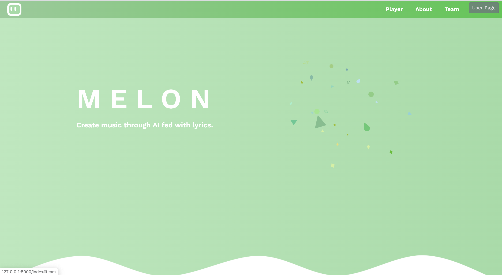
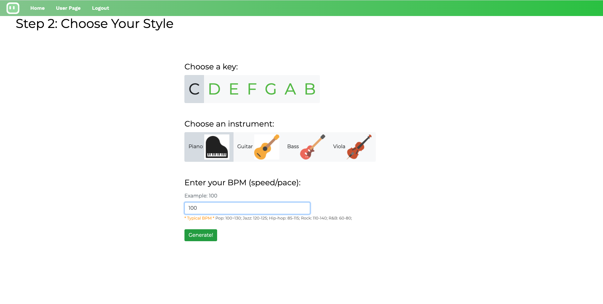
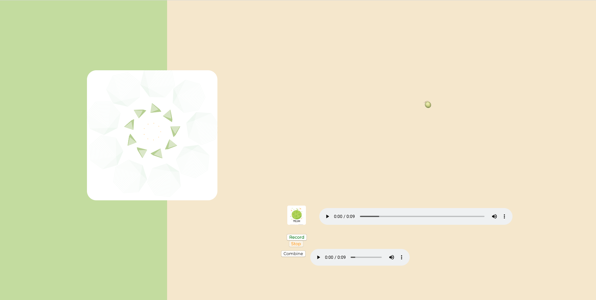

# Lyrics to Melody
### MELON: Create music with your own lyrics!

## Contributors:
* Jiaqi Chen
* Sihan Chen
* Ding Ding
* Wendeng Hu
* Jingxian Li
* Tian Qin
* Yunzheng Zhao

## A Brief Introduction
We trained a conditional-GAN model based on LSTM with 10000+ paired midi files and lyrics to learn the correlations between lyrics and rhythms. We also add multiple keys and instruments options to customize melody according to users' needs.

We want to build an easy-to-use melody generation platform to help those intimidated by the difficulty of music-making to have fun in generating original melodies, and inspire those who are interested in writing songs to further explore their potential in producing quality music.

## Workflow
### Step1: Lyrics searchring

Coming up with your own lyrics is the first step towards music creation here at Melon. If you already have ideas in mind, you can directly put your lyrics in the second textbox and click "Confirm your lyrics" and "Next Step". Otherwise, we provide you some inspirations in the "You May Want to Search" section from where you can click on and get lyrics in the first textbox. You can also search lyrics directly at the top. 

### Step2: Customize your style

Now you can customize key, instrument and speed of your melody here! 

### Step3: Play and record your own voice

Here come's an interactive page where you can listen to the generated melody and record your own voice! 

For the new users, please the instruction on https://feitianxiaozhucjq.wixsite.com/melon to get started!

## Run it locally
If you want run this locally, please follow these steps to set up the environment:
1. Create a environment of Python 3.6, and install the requirements.txt using `pip install -r requirements.txt`.

2. Download required sources from: https://drive.google.com/file/d/1y4xlxM0drLdbFbOIsw6Fbh0XfRAPVqkX/view?usp=sharing

3. Place the entire `data` folder under `app/Melon_Model`.

4. `brew install fluidsynth` (if haven't)

5. Run the web server!
